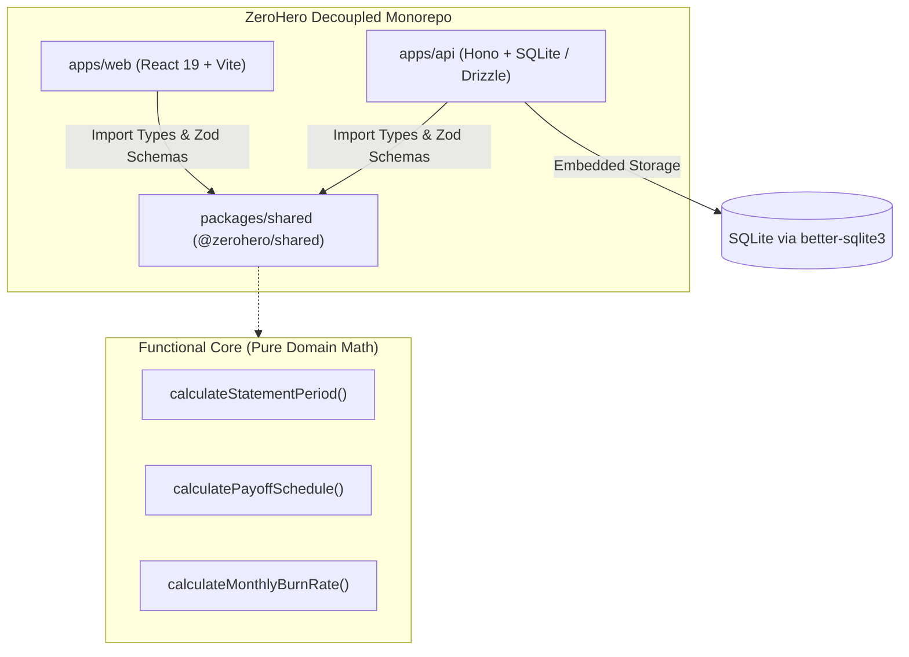

<div align="center">

# 💳 ZeroHero

### *Personal Financial Command Center & Payoff Curve Forecaster*

Track recurring subscriptions, model credit card statement cutoffs with calendar precision, and project debt-free payoff trajectories without financial surprises.

---

[](https://www.typescriptlang.org/)
[](https://nodejs.org/)
[](https://hono.dev/)
[](https://react.dev/)
[](https://vitejs.dev/)
[](https://orm.drizzle.team/)
[](https://vitest.dev/)

</div>

<br />

## 🌟 Overview

Most personal finance apps treat credit cards as simple debit accounts, failing to capture the nuance of **statement closing cutoffs**, **grace periods**, and **multi-month installment payoff curves**. 

**ZeroHero** bridges that gap. It combines a pure functional calculation core with a fast local SQLite database and an intuitive visual dashboard to give cardholders complete foresight into upcoming monthly burn rates and exact payoff dates.

<br />

## ⚡ Key Highlights

- **📅 Calendar-Accurate Statement Boundaries**: Automatically calculates statement cycles based on card closing days, with accurate month-end clamping (e.g. Feb 28/29) and exclusive closing-day purchase rollover (ADR-0002).
- **📉 Payoff Curve Forecasting**: Computes exact payoff trajectories for split purchases and installments, showing when commitments expire and how monthly cash flow recovers over time.
- **🪙 Zero Floating-Point Drift**: All financial figures are strictly calculated and stored as integer cents (`amountInCents`), with remainder pennies distributed deterministically.
- **🏗️ Vertical Slice + Functional Core**: Complex financial math is 100% isolated as pure, side-effect-free domain functions for seamless TDD, while API feature slices directly interact with SQLite via Drizzle ORM (ADR-0001).
- **⚡ Zero-Friction Monorepo**: Shared domain models and Zod schemas resolve directly from TypeScript source across frontend and backend without intermediate compilation bottlenecks.

<br />

## 🏛️ System Architecture



<br />

## 📖 Domain Glossary

| Term | Definition |
| :--- | :--- |
| **Credit Card** | A payment card identified by a friendly nickname, statement closing day, and payment due day. |
| **Statement Period** | The monthly billing window bounded by the closing day and identified by `cycleId` (`YYYY-MM`). |
| **Commitment** | An ongoing financial obligation assigned to a Credit Card (either a Subscription or Installment). |
| **Subscription** | A commitment renewing indefinitely on a recurring cadence until cancelled. |
| **Installment** | A commitment with a fixed total cost divided into a finite number of scheduled payments. |
| **Payoff Date** | The specific statement due date on which the final installment payment is settled. |
| **Burn Rate** | The projected total financial outflow for a given calendar month across active commitments. |

*See [`CONTEXT.md`](CONTEXT.md) for full terminology guidelines and constraints.*

<br />

## 📂 Repository Layout

```text
zerohero/
├── apps/
│   ├── api/               # Hono REST API server (SQLite + Drizzle ORM)
│   └── web/               # Vite React 19 single-page application
├── packages/
│   └── shared/            # Pure domain contracts, Zod schemas, and calculation math
├── CONTEXT.md             # Canonical domain vocabulary & ubiquitous language
├── AGENTS.md              # Autonomous agent instructions and map frontier
└── package.json           # npm workspace root
```

<br />

## 🚀 Getting Started

### Prerequisites

- **Node.js**: `v20.x` or higher
- **npm**: `v10.x` or higher

### Installation

Clone the repository and install workspace dependencies:

```bash
git clone https://github.com/lorrandavi/zerohero.git
cd zerohero
npm install
```

### Development Scripts

Run tests across all workspaces:
```bash
npm run test
```

Typecheck the entire monorepo:
```bash
npm run typecheck
```

Start the API backend:
```bash
npm run dev --workspace=@zerohero/api
```

Start the Web frontend:
```bash
npm run dev --workspace=@zerohero/web
```

<br />

## 🗺️ Engineering Roadmap

The development of ZeroHero is tracked via **Wayfinder** on GitHub Issues:
- Active Map: [GitHub Issue #1: ZeroHero Core Map](https://github.com/lorrandavi/zerohero/issues/1)
- [x] `#4` **Research**: Drizzle ORM + SQLite vertical slice integration
- [x] `#2` **Grilling**: Statement cutoff boundary & calendar rollover edge cases (ADR-0002)
- [x] `#3` **Prototype**: Monorepo scaffolding & zero-friction shared contracts
- [x] `#5` **Task**: Implement pure statement cutoff and payoff schedule math test-first (TDD)
- [ ] `#6` **Task**: Implement SQLite database schema and migrations via Drizzle ORM in apps/api
- [ ] Visual dashboard & payoff curve projection charts

